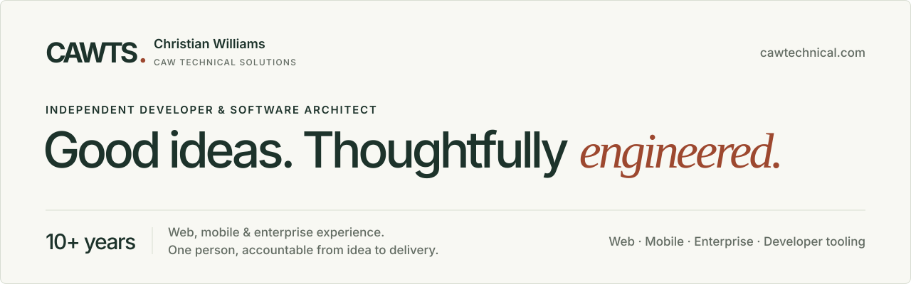

**Web, mobile, and enterprise development · 10+ years of experience**

I’m Christian, an independent developer and software architect working through **CAW Technical Solutions**. I build applications, work through complex software problems, and manage the infrastructure behind my own products.

[Explore my portfolio](https://cawtechnical.com) · [Discuss a project](https://cal.com/christian-williams) · [Email me](mailto:hello@cawtechnical.com)

Most of my repositories are private for now, so there isn’t much to browse here yet. This page is a guide to what sits behind them, including two projects I plan to open-source.

---

## Heading for open source

**Cawtex** and **Cilica** are planned to be open-sourced once they reach a level of feature completeness I’m happy to support publicly. Until then they stay private while their core design settles. When they’re ready, they’ll be published here.

| Project | What it does | Status |
| :-- | :-- | :-- |
| **Cawtex** | Coordinates parallel app runs for developers and coding agents | Development preview |
| **Cilica** | Compiles .NET IL to C++, so C# libraries can run without the .NET runtime | Early development |

### Cawtex

A local runtime that coordinates parallel application runs for developers and coding agents. When several agents work on different versions of the same app, Cawtex assigns ports, makes each frontend’s backend connection explicit, and supervises the processes, so versions don’t clash and running services stay visible after the conversation that started them ends.

A React dashboard, a local API, and an MCP server share one registry, giving people and agents the same controls. Project detection reads files without executing them, and nothing runs until its configuration has been reviewed. I use it in my own development work.

**Developer tooling · .NET · YARP · SQLite · React · MCP · Swift**

### Cilica

An independent .NET IL-to-C++ compiler and managed runtime, designed so existing C# libraries can run inside native and browser applications, offline and without the .NET runtime, while behaving the same on every platform.

The metadata and dependency-audit foundation is in place: assemblies are read strictly as data and never loaded, malformed input produces numbered diagnostics instead of crashes, and a first integer subset compiles to C++ and is checked against .NET results. Objects, strings, garbage collection, and iOS, Android, and WebAssembly targets come next.

**Compiler engineering · C# / .NET · System.Reflection.Metadata · C++20**

## Delivered work

### Travel insurance platforms

Delivered work on a **customer portal for travel insurance offered with NatWest, RBS, and Nationwide debit cards**, alongside an **internal business automation and management tool**.

The project spanned customer-facing insurance software and the tools used within the business.

## Other projects I’m building

### Daypace

A productivity app bringing focus, planning, and sensory tools into one experience. Custom canvas rendering and gesture-driven interactions are central to the product.

**Product design · React Native · Skia · Reanimated**

### Alchemy

A tactical multiplayer card game built on a deterministic C# engine. A reusable resolution kernel, viewer-specific state, and replay verification address the complexity behind a shared match.

**Software architecture · C# / .NET · SignalR · Deterministic systems**

### Echo Ed

An education platform connecting question practice, teacher oversight, and student progress. Transactional answer handling and membership-based access keep those workflows consistent.

**Application engineering · React Native · .NET · PostgreSQL**

## From application to infrastructure

I run a self-managed **Hetzner, Coolify, and Docker** stack for my projects, with application-specific PostgreSQL databases, protected management access through Cloudflare, and GitHub Actions release automation.

My work spans interfaces, APIs, data modelling, deployment, and the tooling around them. I’m interested in how those decisions fit together—and how clearly they can be explained to the people relying on the software.

---

**Have a product to build, an application to improve, or a technical problem to work through?**

[Let’s talk →](https://cal.com/christian-williams)
